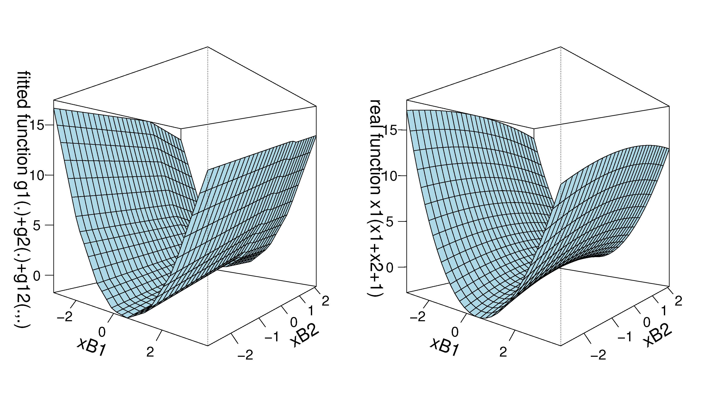

# Dimension Reduction and MARS
We aim to improve the performance of the conventional MARS by using linear combinations of the covariates which achieve sufficient dimension reduction. The proposed methodology is called drMARS.

Paper: [[2302.05790] Dimension Reduction and MARS (arxiv.org)](https://arxiv.org/abs/2302.05790)

### Usage ###

In our numerical studies, we explore the finite-sample performance of drMARS in estimating the SDR (sufficient dimension reduction) space. We also examine the estimated dimension of the SDR space, and the estimation/prediction performance. The corresponding functions are "drMARS", "drMARS.CV" and "drMARS.fit", respectively. 

* B = drMARS(x, y, degree = NULL, Xscale=F, plus=F)$B

  The estimation accuracy of the SDR space is evaluated using the true dimension of the SDR space

* d=drMARS.CV(B, max.dim=5, nfold=10)$ndir
  We select the dimension of SDR space via the 10-fold cross-validation.

* fit = drMARS.fit(x,y,xnew,degree = NULL,Xadd=T,Xnorm=F,Xscale=F,plus=F,iter=F,ndir="NoPreSel",max.dim = 5,max.iter=50)

  estimation=fit$fitted
  
  prediction=fit$predicted
  
  We provide a few arguments in the function to make estimation/prediction using drMARS, and users need to adjust them to improve the accuracy based on the data. The usage of the parameters is described in the file "drMARS.fit.R".

We next provide a three-dimensional graph to demonstrate the estimation performance of drMARS. The left plot in the following figure is the estimated function whereas the right plot is the true one. By comparing the two plots, we observe that drMARS provides a good model fitting. Please refer to "example_scripts" file for more details. 

### Datasets ###

The 7 real data dets used in the paper are available in the "DataSets" folder which contain the data loading and pre-processing script ("DataSets.R"). The datasets are obtained from the UCI repository [(UCI Machine Learning Repository)](https://archive.ics.uci.edu/ml/index.php) and the Kaggle [(Kaggle: Your Machine Learning and Data Science Community)](https://www.kaggle.com/), which are available freely online. The introduction of the data information is provided in Section 5 of the paper.

### Contribution guidelines ###

Any improvements or conversions to other code formats would be appreciated. Please send me an email if you require assistance. 

Yu Liu: liuyuchina123@gmail.com.
